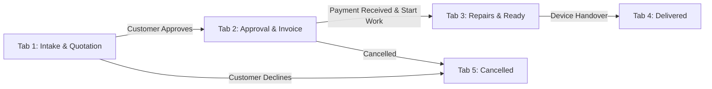
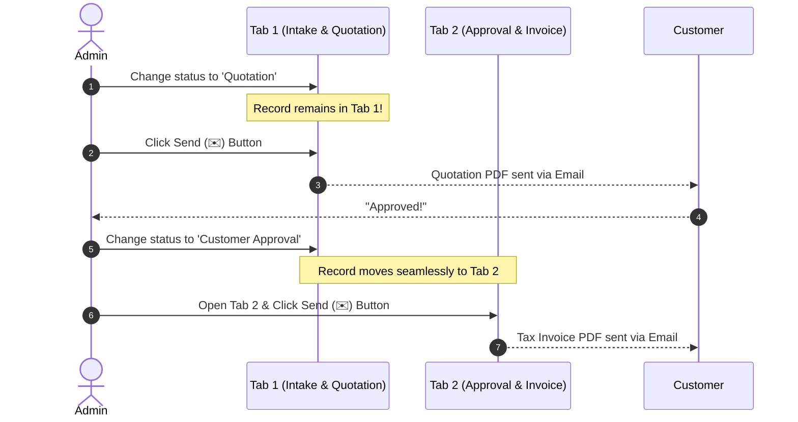

# Service Quotation & Invoice Lifecycle Workflow Guide

## 1. Overview & Objective
This document outlines the **5-Tab Lifecycle Architecture** and **Multi-Stage Document & Email Dispatch System** for Simcha Billing Services & Repairs.

---

## 2. The 5-Tab Service Lifecycle Architecture

### Tab Breakdown & Permissions

| Tab No | Tab Name | Stages Included | Available Document in Eye (👁️) Action | Email Send (✉️) Action Type |
| :--- | :--- | :--- | :--- | :--- |
| **Tab 1** | **Intake & Quotation** | `Received`, `Quotation` | 📄 **Service Quotation (Estimate)** | 📤 **Quotation PDF** (Active on Quotation status) |
| **Tab 2** | **Approval & Invoice** | `Customer Approval`, `Payment Received` | 🧾 **Official Tax Invoice** | 📤 **Tax Invoice PDF** |
| **Tab 3** | **Repairs & Ready** | `Repair In-Progress`, `Ready` | 🧾 **Tax Invoice** + 🟣 **Receipt** | 📤 **Payment Receipt PDF** |
| **Tab 4** | **Delivered** | `Delivered` | 🧾 **Tax Invoice** + 🟣 **Receipt** | 📤 **Delivery & Receipt Note** |
| **Tab 5** | **Cancelled** | `Cancelled`, `Cancel` | 📄 View Previous Record | 🚫 Disabled |

---

## 3. The 2 Solutions for Moving Records & Email Dispatch

### Solution 1: Natural In-Tab Workflow (Recommended Standard)
Each Tab contains **both the preparation stage and the transition stage**. Therefore, records **never disappear prematurely** before sending emails.

---

### Solution 2: Automated Action Prompt on Status Change (One-Click Power Feature)
When an admin changes the status in the dropdown, the system displays a confirmation prompt to send the email immediately in one click.

> [!TIP]
> **Prompt Example:**
> When status is changed to `Quotation`:
> > *"Status updated to Quotation. Would you like to email the Quotation PDF to customer (customer@email.com) now?"*
> > `[Yes, Send Email]` &nbsp; `[No, I'll Send Later]`

- If **[Yes]**: Email is dispatched immediately in the background with zero extra clicks.
- If **[No]**: Status updates, and the manual **Send (✉️)** button in the actions column remains available at all times.

---

## 4. Multi-Stage Email Tracking Schema in Database
To ensure independent stage email dispatches, the `service_bills` table stores:
- `quotation_number` (e.g., `SIS-QT/2026-27/0001`)
- `quotation_email_sent` (BOOLEAN) & `quotation_email_sent_at` (DATETIME)
- `invoice_email_sent` (BOOLEAN) & `invoice_email_sent_at` (DATETIME)
- `receipt_email_sent` (BOOLEAN) & `receipt_email_sent_at` (DATETIME)

---

## 5. Dynamic Quotation Numbering Scheme
In Settings:
- Prefix: `SIS-QT` (or user customizable)
- Financial Year: `2026-27` (or auto)
- Month: `AUTO` / custom
- Starting Number: `1` with 4-digit padding
- Format: `SIS-QT/OCT/2026-27/0001`
